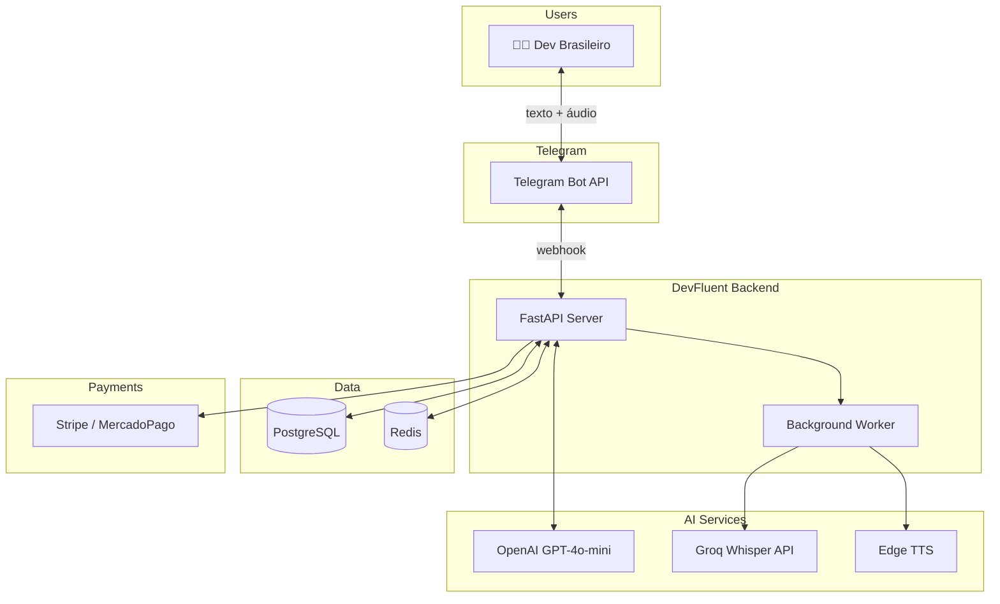
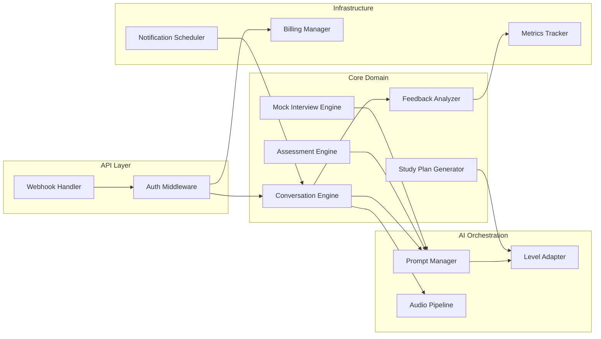
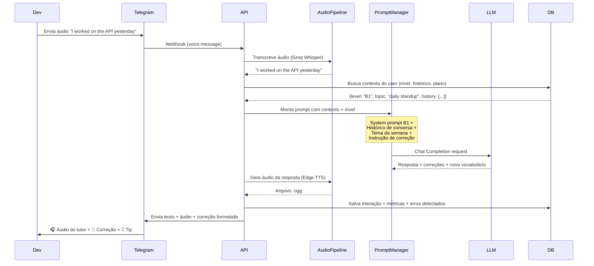
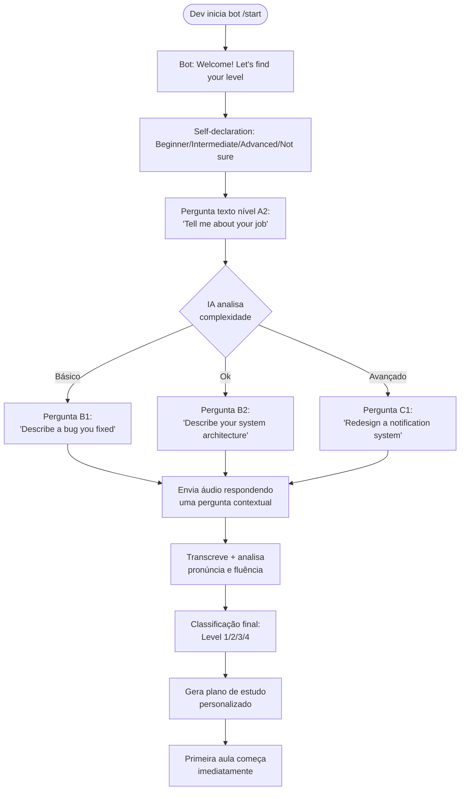

# DevFluent — English for Developers

> Plataforma de aprendizado de inglês com IA focada em devs: preparação para entrevistas técnicas e fluência no dia-a-dia de trabalho remoto.

---

## 1. Lean MVP Canvas

### Hipótese Central
**"Desenvolvedores brasileiros pagam R$ 29-49/mês por um tutor de IA via Telegram que simula entrevistas técnicas em inglês, corrige pronúncia e adapta o conteúdo ao seu nível — porque precisam disso pra conseguir (e manter) vagas remotas internacionais."**

### Personas (3)

| Persona | Perfil | Nível CEFR | Dor Principal |
|---------|--------|------------|---------------|
| **Junior Global** | Dev Jr/Pleno, 1-3 anos XP, quer primeira vaga remota internacional | A2-B1 | Trava na entrevista em inglês. Sabe codar, mas não consegue explicar o que faz |
| **Senior Remoto** | Dev Sênior, já contratado em empresa gringa ou buscando | B1-B2 | Participa de daily/planning mas fala pouco, tem vergonha de erros, não pega idioms |
| **Tech Lead Global** | Lead/Staff, precisa liderar reuniões, fazer 1:1, apresentar | B2-C1 | Precisa de fluência profissional: negociação, feedback, apresentações técnicas |

### Core Loop
```
[Dev abre Telegram] 
  → [Tutor puxa assunto contextual: "How was your standup today?"]
    → [Dev responde por áudio ou texto]
      → [IA corrige, dá feedback, ensina expressão nova]
        → [Dev pratica mais, ganha XP, sobe de nível]
          → [Notificação no dia seguinte: "Ready for mock interview?"]
            → [LOOP]
```

**"Aha Moment"**: Quando o dev faz o primeiro mock interview completo e recebe feedback detalhado de pronúncia + vocabulário técnico + sugestões de melhoria.

### Features MVP — MoSCoW

#### MUST HAVE (5 features core)
1. **Onboarding Assessment** — Teste de nivelamento por conversa (texto + áudio) que classifica em A2/B1/B2/C1
2. **Conversação adaptativa por nível** — Chat com tutor IA via Telegram (texto + áudio), vocabulário e complexidade adapta ao nível
3. **Mock Interview Mode** — Simulação de entrevista técnica (behavioral + system design) com feedback estruturado
4. **Feedback de pronúncia e gramática** — Correção em tempo real com explicação em português
5. **Plano de estudo semanal** — Gerado automaticamente baseado no nível e metas do dev

#### SHOULD HAVE (pós-validação imediata)
- Score de pronúncia com visualização (waveform/fonemas)
- Vocabulary tracker (palavras aprendidas, spaced repetition)
- Daily standup simulator
- Progresso visual (dashboard de evolução)

#### COULD HAVE (backlog v2)
- Code review em inglês (dev explica seu PR)
- Modo pair programming (explicar código em inglês)
- Comunidade de devs praticando juntos
- WhatsApp como canal adicional
- Preparação para certificados (TOEFL, IELTS)

#### WON'T HAVE (explicitamente fora)
- App nativo (Telegram first)
- Vídeo chamada com avatar
- Ensino de gramática formal/acadêmica
- Conteúdo para crianças/adolescentes
- Outros idiomas além de inglês

### Explicitamente Fora do Escopo do MVP
- Admin dashboard elaborado (usa Retool/planilha)
- Sistema de pagamento próprio (usa Stripe/Mercado Pago link)
- Múltiplos idiomas
- Versão WhatsApp (fase 2)
- App mobile nativo

---

## 2. Sistema de Níveis e Avaliação

### 2.1 Assessment Inicial (Onboarding)

O nivelamento acontece na **primeira conversa** com o bot, de forma natural (não é um "teste" formal):

```
FASE 1 — Self Declaration (30s)
  Bot: "Hey! Welcome to DevFluent. Before we start, how would you 
       rate your English? Don't worry, there's no wrong answer!"
  Opções: [Beginner] [Intermediate] [Advanced] [Not sure]

FASE 2 — Written Assessment (2-3 min)
  Bot faz 3-4 perguntas progressivas por TEXTO:
  
  Nível A2: "Tell me about your current job in 2-3 sentences"
  Nível B1: "What's the most challenging bug you've ever fixed? 
            How did you solve it?"
  Nível B2: "Describe the architecture of a system you've built. 
            What trade-offs did you make?"
  Nível C1: "If you had to redesign Twitter's notification system 
            for scale, what approach would you take?"

  IA analisa: vocabulário, complexidade gramatical, coerência, 
  uso de termos técnicos

FASE 3 — Speaking Assessment (2-3 min)
  Bot: "Now let's hear your voice! Send me a voice message 
       answering this question..."
  
  Pergunta adaptada ao que detectou no texto.
  IA analisa: pronúncia, fluência, hesitações, filler words

RESULTADO → Classificação em um dos 4 níveis
```

### 2.2 Modelo de Níveis (4 níveis para MVP)

```
┌─────────────────────────────────────────────────────────────────┐
│                    DEVFLUENT LEVEL SYSTEM                        │
├──────────┬──────────────────────────────────────────────────────┤
│ LEVEL 1  │ FOUNDATION (≈ CEFR A2)                               │
│ 🟢       │ Entende código, mas não consegue explicar             │
│          │ Vocabulário: ~500 palavras técnicas                   │
│          │ Foco: sobrevivência em daily standups                 │
├──────────┼──────────────────────────────────────────────────────┤
│ LEVEL 2  │ COMMUNICATOR (≈ CEFR B1)                              │
│ 🔵       │ Consegue se comunicar, mas com erros frequentes       │
│          │ Vocabulário: ~1500 palavras técnicas                  │
│          │ Foco: participar ativamente de reuniões               │
├──────────┼──────────────────────────────────────────────────────┤
│ LEVEL 3  │ PROFESSIONAL (≈ CEFR B2)                              │
│ 🟣       │ Comunica ideias complexas, erros ocasionais           │
│          │ Vocabulário: ~3000 palavras técnicas                  │
│          │ Foco: liderar discussões técnicas, entrevistas        │
├──────────┼──────────────────────────────────────────────────────┤
│ LEVEL 4  │ FLUENT (≈ CEFR C1)                                    │
│ 🟡       │ Fluente, foco em polish e nuances culturais           │
│          │ Vocabulário: ~5000+ palavras                          │
│          │ Foco: negociação, apresentações, liderança            │
└──────────┴──────────────────────────────────────────────────────┘
```

### 2.3 Plano de Estudo por Nível

#### LEVEL 1 — FOUNDATION (A2)

**Meta**: Em 3 meses, conseguir sobreviver numa daily standup.

| Semana | Tema | Tipo de Prática | Exemplo de Atividade |
|--------|------|-----------------|----------------------|
| 1-2 | Self introduction | Texto + Áudio | "Introduce yourself as if you just joined a new team" |
| 3-4 | Daily standup | Áudio | "What did you do yesterday? What will you do today? Any blockers?" |
| 5-6 | Describing code | Texto | "Explain this function to me like I'm a junior dev" |
| 7-8 | Asking for help | Áudio | "You're stuck on a bug. Ask your senior for help" |
| 9-10 | Code review basics | Texto + Áudio | "Review this PR and leave comments in English" |
| 11-12 | Mini mock interview | Áudio | "Tell me about yourself" + 2 behavioral questions |

**Vocabulário foco**: git terms, basic CS, common verbs (deploy, implement, refactor, debug), meeting phrases.

**Gramática foco**: Present simple/continuous, past simple, basic conditionals ("If the test fails...").

#### LEVEL 2 — COMMUNICATOR (B1)

**Meta**: Em 3 meses, participar ativamente de planning/retro e passar screening calls.

| Semana | Tema | Tipo de Prática | Exemplo de Atividade |
|--------|------|-----------------|----------------------|
| 1-2 | Sprint planning | Áudio | "Estimate this ticket and explain your reasoning" |
| 3-4 | Technical discussion | Texto + Áudio | "Debate: SQL vs NoSQL for this use case" |
| 5-6 | Behavioral interview | Áudio | STAR method practice (Situation, Task, Action, Result) |
| 7-8 | Incident response | Áudio | "There's a production outage. Communicate the situation" |
| 9-10 | Architecture basics | Texto + Áudio | "Explain how you'd design a URL shortener" |
| 11-12 | Full mock interview | Áudio | 30-min behavioral + technical screening simulation |

**Vocabulário foco**: Agile terms, cloud/infra, design patterns (in plain English), idioms de trabalho ("let's circle back", "take it offline").

**Gramática foco**: Present perfect, passive voice, reported speech, conditionals II/III.

#### LEVEL 3 — PROFESSIONAL (B2)

**Meta**: Em 3 meses, liderar uma tech discussion e passar entrevistas de system design.

| Semana | Tema | Tipo de Prática | Exemplo de Atividade |
|--------|------|-----------------|----------------------|
| 1-2 | System design interview | Áudio | "Design a chat application like Slack" |
| 3-4 | Leading meetings | Áudio | "You're running the retro. Facilitate the discussion" |
| 5-6 | Giving feedback (1:1) | Áudio | "Give constructive feedback to a teammate about code quality" |
| 7-8 | Writing RFCs/ADRs | Texto | Write a technical proposal in English |
| 9-10 | Cross-team communication | Áudio | "Explain a technical decision to a PM who isn't technical" |
| 11-12 | Full system design mock | Áudio | 45-min system design interview simulation |

**Vocabulário foco**: Architecture terms, business English, presentation language, negotiation phrases.

**Gramática foco**: Complex sentences, subjunctive, nuanced modals ("might want to consider"), hedging language.

#### LEVEL 4 — FLUENT (C1)

**Meta**: Polish cultural e profissional. Liderar com confiança.

| Semana | Tema | Tipo de Prática | Exemplo de Atividade |
|--------|------|-----------------|----------------------|
| 1-2 | Executive communication | Áudio | "Present your team's quarterly results to the VP" |
| 3-4 | Difficult conversations | Áudio | "Push back on an unrealistic deadline diplomatically" |
| 5-6 | Cultural nuances | Texto + Áudio | American vs British workplace culture, humor, small talk |
| 7-8 | Conference talks | Áudio | "Give a 5-min lightning talk about your recent project" |
| 9-10 | Negotiation | Áudio | "Negotiate a raise" / "Negotiate scope with stakeholders" |
| 11-12 | Free-form mastery | Áudio | Open discussions on tech topics, podcasts analysis |

**Vocabulário foco**: Idioms, phrasal verbs, cultural references, humor, slang profissional.

**Gramática foco**: Minimal — foco em style, tone, register, emphasis.

### 2.4 Avaliações Periódicas

```
AVALIAÇÃO CONTÍNUA (toda interação)
├── Tracking automático de:
│   ├── Vocabulário usado (novas palavras, repetições)
│   ├── Erros recorrentes (gramática patterns)
│   ├── Fluência de áudio (hesitações, filler words, speech rate)
│   └── Complexidade das respostas
│
CHECKPOINT SEMANAL (todo domingo)
├── Bot envia "Weekly Report":
│   ├── Minutos praticados
│   ├── Palavras novas aprendidas
│   ├── Top 3 erros da semana
│   ├── Sugestão de foco para próxima semana
│   └── Streak / XP acumulado
│
AVALIAÇÃO DE NÍVEL (a cada 4 semanas)
├── "Level Check" — conversa estruturada (5-10 min):
│   ├── 2 perguntas texto (complexidade do nível atual+1)
│   ├── 1 pergunta áudio (cenário do nível atual+1)
│   ├── Resultado: STAY / LEVEL UP / (nunca desce)
│   └── Se LEVEL UP → celebração + novo plano desbloqueado
│
MOCK INTERVIEW ASSESSMENT (a cada 8 semanas)
├── Simulação completa de entrevista:
│   ├── Level 1-2: Screening call (15 min)
│   ├── Level 3: System design (30 min)
│   ├── Level 4: Leadership/behavioral deep (30 min)
│   └── Report detalhado com score por categoria
```

---

## 3. Arquitetura do MVP

### 3.1 Diagrama de Alto Nível (C4 — Context)



### 3.2 Diagrama de Componentes



### 3.3 Fluxo Principal — Conversa com Tutor



### 3.4 Fluxo de Onboarding/Assessment



---

## 4. Modelo de Dados (Simplificado)

```sql
-- Usuário
CREATE TABLE users (
    id              UUID PRIMARY KEY DEFAULT gen_random_uuid(),
    telegram_id     BIGINT UNIQUE NOT NULL,
    name            VARCHAR(255),
    email           VARCHAR(255),
    current_level   SMALLINT NOT NULL DEFAULT 1,  -- 1=Foundation, 2=Communicator, 3=Professional, 4=Fluent
    cefr_estimate   VARCHAR(2),                   -- A2, B1, B2, C1
    onboarding_done BOOLEAN DEFAULT FALSE,
    subscription    VARCHAR(20) DEFAULT 'free',    -- free, active, cancelled, expired
    stripe_id       VARCHAR(255),
    weekly_goal_min INTEGER DEFAULT 60,            -- minutos por semana
    timezone        VARCHAR(50) DEFAULT 'America/Sao_Paulo',
    created_at      TIMESTAMPTZ DEFAULT NOW(),
    updated_at      TIMESTAMPTZ DEFAULT NOW()
);

-- Plano de estudo ativo
CREATE TABLE study_plans (
    id              UUID PRIMARY KEY DEFAULT gen_random_uuid(),
    user_id         UUID REFERENCES users(id),
    level           SMALLINT NOT NULL,
    week_number     SMALLINT NOT NULL,
    theme           VARCHAR(255),                 -- "Daily standup", "Mock interview"
    focus_skills    JSONB,                        -- ["speaking", "vocabulary", "pronunciation"]
    target_vocab    JSONB,                        -- ["deploy", "refactor", "trade-off"]
    completed       BOOLEAN DEFAULT FALSE,
    created_at      TIMESTAMPTZ DEFAULT NOW()
);

-- Conversas
CREATE TABLE conversations (
    id              UUID PRIMARY KEY DEFAULT gen_random_uuid(),
    user_id         UUID REFERENCES users(id),
    mode            VARCHAR(30) NOT NULL,         -- "free_chat", "mock_interview", "assessment", "lesson"
    topic           VARCHAR(255),
    level_at_time   SMALLINT,
    started_at      TIMESTAMPTZ DEFAULT NOW(),
    ended_at        TIMESTAMPTZ,
    summary         TEXT,                         -- Resumo gerado por IA
    errors_found    JSONB,                        -- [{type: "grammar", detail: "...", correction: "..."}]
    new_vocab       JSONB                         -- ["trade-off", "scalable"]
);

-- Mensagens dentro da conversa
CREATE TABLE messages (
    id              UUID PRIMARY KEY DEFAULT gen_random_uuid(),
    conversation_id UUID REFERENCES conversations(id),
    role            VARCHAR(10) NOT NULL,         -- "user" | "assistant"
    content_text    TEXT,
    content_audio   VARCHAR(500),                 -- URL do áudio no storage
    transcription   TEXT,                         -- Transcrição do áudio do user
    corrections     JSONB,                        -- Correções aplicadas nesta msg
    pronunciation   JSONB,                        -- Score/detalhes de pronúncia
    tokens_used     INTEGER,
    created_at      TIMESTAMPTZ DEFAULT NOW()
);

-- Avaliações periódicas
CREATE TABLE assessments (
    id              UUID PRIMARY KEY DEFAULT gen_random_uuid(),
    user_id         UUID REFERENCES users(id),
    type            VARCHAR(20) NOT NULL,         -- "onboarding", "level_check", "mock_interview"
    level_before    SMALLINT,
    level_after     SMALLINT,
    scores          JSONB,                        -- {grammar: 7, vocabulary: 8, pronunciation: 6, fluency: 7}
    feedback        TEXT,
    conversation_id UUID REFERENCES conversations(id),
    created_at      TIMESTAMPTZ DEFAULT NOW()
);

-- Vocabulário do usuário (spaced repetition)
CREATE TABLE user_vocabulary (
    id              UUID PRIMARY KEY DEFAULT gen_random_uuid(),
    user_id         UUID REFERENCES users(id),
    word            VARCHAR(255) NOT NULL,
    context         TEXT,                         -- Frase onde aprendeu
    level_learned   SMALLINT,
    times_seen      INTEGER DEFAULT 1,
    times_used      INTEGER DEFAULT 0,
    next_review     TIMESTAMPTZ,
    ease_factor     FLOAT DEFAULT 2.5,            -- SM-2 algorithm
    created_at      TIMESTAMPTZ DEFAULT NOW(),
    UNIQUE(user_id, word)
);

-- Métricas semanais (weekly report)
CREATE TABLE weekly_metrics (
    id              UUID PRIMARY KEY DEFAULT gen_random_uuid(),
    user_id         UUID REFERENCES users(id),
    week_start      DATE NOT NULL,
    minutes_practiced INTEGER DEFAULT 0,
    messages_sent   INTEGER DEFAULT 0,
    audio_messages  INTEGER DEFAULT 0,
    new_words       INTEGER DEFAULT 0,
    errors_grammar  INTEGER DEFAULT 0,
    errors_pronunciation INTEGER DEFAULT 0,
    streak_days     INTEGER DEFAULT 0,
    xp_earned       INTEGER DEFAULT 0,
    UNIQUE(user_id, week_start)
);
```

---

## 5. Stack Recomendada

| Camada | Tecnologia | Justificativa | Custo/mês (100 users) |
|--------|-----------|---------------|----------------------|
| **Bot Framework** | python-telegram-bot (PTB) | Lib oficial, async, bem documentada | $0 |
| **Backend** | FastAPI + Python 3.12 | Async nativo, tipagem, ótimo pra IA | $0 |
| **LLM** | OpenAI GPT-4o-mini API | Barato ($0.15/1M input), segue instruções bem | ~$15 |
| **STT** | Groq Whisper (API) | Grátis no tier, ultra-rápido (<1s) | $0 |
| **TTS** | Edge TTS (edge-tts lib) | Grátis, vozes naturais, múltiplos sotaques | $0 |
| **Database** | PostgreSQL (Supabase free tier ou Neon) | Relacional, JSONB, grátis pra começar | $0 |
| **Cache** | Redis (Upstash free tier) | Rate limiting, sessões, contexto rápido | $0 |
| **Hosting** | Railway ou Render | Deploy fácil, $5-7/mês por serviço | ~$7 |
| **Storage** | Cloudflare R2 (áudios) | 10GB grátis, sem egress fee | $0 |
| **Payments** | Stripe | Padrão global, fácil de integrar | 3.4% + R$0.40/tx |
| **Monitoring** | Sentry (free) + PostHog (free) | Erros + analytics de produto | $0 |
| **Scheduler** | APScheduler (in-process) ou Celery | Notificações, weekly reports | $0 |

### Custo mensal estimado:

| Escala | LLM | STT | TTS | Infra | Total | Por aluno |
|--------|-----|-----|-----|-------|-------|-----------|
| **100 users** | ~$15 | $0 (Groq free) | $0 (Edge) | $10 | **~$25** | **~R$ 1,50** |
| **1.000 users** | ~$150 | ~$30 (Groq paid) | $0 (Edge) | $30 | **~$210** | **~R$ 1,20** |
| **10.000 users** | ~$1.500 | ~$200 (self-host) | $0 (Edge) | $150 | **~$1.850** | **~R$ 1,10** |

**Margem com R$ 29/mês por aluno: ~95% nos primeiros 100 users. ~93% com 10K users.**

---

## 6. API Contracts (Endpoints Core)

### Telegram Webhook
```
POST /webhook/telegram
Body: Telegram Update object
→ Roteia para handler baseado no tipo (text, voice, callback_query)
```

### Conversation Engine (interno)
```python
# Processa mensagem do usuário
async def process_message(
    user_id: UUID,
    message_type: Literal["text", "voice"],
    content: str | bytes,  # texto ou arquivo de áudio
) -> TutorResponse:
    """
    Returns:
        TutorResponse(
            text: str,           # Resposta do tutor
            audio_url: str,      # Áudio gerado (Edge TTS)
            corrections: list,   # Correções de gramática/vocab
            new_vocabulary: list, # Palavras novas ensinadas
            pronunciation: dict,  # Feedback de pronúncia (se áudio)
            xp_earned: int,
        )
    """
```

### Assessment Engine (interno)
```python
async def run_assessment(
    user_id: UUID,
    assessment_type: Literal["onboarding", "level_check", "mock_interview"],
) -> AssessmentResult:
    """
    Returns:
        AssessmentResult(
            current_level: int,
            recommended_level: int,
            scores: {grammar, vocabulary, pronunciation, fluency, technical},
            strengths: list[str],
            weaknesses: list[str],
            study_plan: StudyPlan,
        )
    """
```

### Study Plan Generator (interno)
```python
async def generate_study_plan(
    user_id: UUID,
    level: int,
    week_number: int,
    focus_areas: list[str] | None = None,
) -> StudyPlan:
    """
    Returns:
        StudyPlan(
            theme: str,
            daily_tasks: list[DailyTask],
            target_vocabulary: list[str],
            mock_interview_scheduled: bool,
            estimated_minutes: int,
        )
    """
```

---

## 7. Prompt Architecture

### System Prompt Base (aplicado em todas as interações)
```
You are an English tutor specialized in helping software developers 
improve their professional English. You are friendly, patient, and 
encouraging.

CURRENT USER CONTEXT:
- Name: {user_name}
- Level: {level} ({cefr})
- Current theme: {weekly_theme}
- Known vocabulary: {vocab_count} words
- Top recurring errors: {top_errors}
- Native language: Brazilian Portuguese

RULES:
1. ALWAYS respond in English
2. Adapt your vocabulary and sentence complexity to the user's level
3. When the user makes a grammar/vocabulary mistake, correct it 
   naturally — include the correction INLINE and explain briefly in 
   Portuguese between parentheses
4. Introduce 1-2 new vocabulary words per interaction, relevant to 
   the current theme
5. If the user seems stuck, offer the Portuguese translation and 
   encourage them to try again
6. Track and reference previous conversations for continuity
7. Be encouraging but honest — celebrate progress, don't ignore errors
```

### Level-Specific Prompt Additions

```python
LEVEL_PROMPTS = {
    1: """
    LEVEL 1 — FOUNDATION (A2):
    - Use simple, short sentences (max 10-12 words)
    - Vocabulary: basic tech terms only (deploy, bug, test, merge, push)
    - Grammar focus: present simple, past simple
    - Correct ALL errors — user needs to build foundations
    - Offer Portuguese translations freely
    - Speak slowly in TTS (rate=0.85)
    - Topics: self-introduction, daily standup, basic task description
    """,
    
    2: """
    LEVEL 2 — COMMUNICATOR (B1):
    - Use moderate complexity sentences
    - Vocabulary: expand to agile, cloud basics, common idioms
    - Grammar focus: present perfect, passive voice, conditionals
    - Correct important errors, let minor ones slide if meaning is clear
    - Portuguese translations only when user explicitly struggles
    - Normal speech rate (rate=1.0)
    - Topics: sprint planning, technical discussions, behavioral interview prep
    """,
    
    3: """
    LEVEL 3 — PROFESSIONAL (B2):
    - Use natural, professional English — don't simplify
    - Vocabulary: architecture terms, business English, meeting facilitation
    - Grammar focus: complex structures, subjunctive, hedging language
    - Only correct errors that would sound unprofessional
    - No Portuguese unless user code-switches first
    - Normal-fast speech rate (rate=1.05)
    - Topics: system design, leading meetings, giving feedback, writing RFCs
    """,
    
    4: """
    LEVEL 4 — FLUENT (C1):
    - Speak naturally, use idioms, humor, cultural references
    - Vocabulary: nuanced expressions, phrasal verbs, register awareness
    - Grammar: only correct if it changes meaning or sounds non-native
    - Focus feedback on STYLE, TONE, and CULTURAL APPROPRIATENESS
    - Challenge the user — play devil's advocate, ask follow-ups
    - Slightly fast speech rate (rate=1.10)
    - Topics: executive comms, negotiation, conference talks, difficult conversations
    """
}
```

### Mock Interview Prompt
```
You are now a tech interviewer at a top Silicon Valley company.
Interview type: {interview_type}  # behavioral | system_design | screening
Company vibe: {company_style}     # google | startup | enterprise

Conduct the interview naturally:
1. Start with small talk (30s)
2. Ask questions one at a time, wait for answers
3. Ask follow-up questions based on answers
4. At the end, provide DETAILED feedback:
   - English proficiency score (1-10)
   - Technical communication score (1-10)
   - Areas of improvement
   - Specific phrases that could be improved
   - Would you pass this interview? (honest assessment)
```

---

## 8. Métricas de Validação

### North Star Metric
**Weekly Active Practicing Minutes (WAPM)** — Minutos de prática ativa por semana por usuário.

Target: ≥ 30 min/semana = usuário "ativo e aprendendo"

### Métricas de Ativação
| Métrica | Target | Como medir |
|---------|--------|------------|
| % completa onboarding | ≥ 70% | assessment concluído / starts |
| % envia primeiro áudio | ≥ 50% | primeiro voice msg / onboarded |
| Time to "aha moment" | ≤ 3 dias | tempo até primeiro mock interview |

### Métricas de Retenção
| Métrica | Target | Observação |
|---------|--------|------------|
| D1 (volta no dia seguinte) | ≥ 40% | Notificação matinal ajuda |
| D7 (volta na semana) | ≥ 30% | Plano de estudo semanal |
| D30 (volta no mês) | ≥ 20% | Level check + mock interview |
| Churn mensal (pagantes) | ≤ 10% | Acompanhar de perto |

### Métricas de Valor
| Métrica | Target | Como medir |
|---------|--------|------------|
| NPS | ≥ 40 | Survey no app a cada 30 dias |
| Level up rate | ≥ 15%/mês | % que sobe de nível por mês |
| Mock interview score | Melhoria ≥ 10% em 30d | Comparar scores periódicos |
| Willingness to pay | ≥ 60% | Trial → conversão paga |

### Gate de Decisão (semana 8)
```
GO    → D7 ≥ 25% AND conversão trial→pago ≥ 10% AND NPS ≥ 30
PIVOT → D7 ≥ 15% mas conversão < 10% (problema de pricing ou value prop)
KILL  → D7 < 15% (produto não retém, hipótese invalidada)
```

---

## 9. Timeline & Milestones

| Fase | Entrega | Prazo | Gate |
|------|---------|-------|------|
| **0** | Setup: repo, CI/CD, bot telegram rodando, DB | 3 dias | Bot responde /start |
| **1** | Assessment + Chat adaptativo (texto only) | +1 semana | Dev faz onboarding e conversa por texto |
| **2** | Audio pipeline (STT + TTS) | +1 semana | Dev envia áudio e recebe áudio de volta |
| **3** | Plano de estudo + weekly reports | +1 semana | Dev recebe plano semanal e relatório |
| **4** | Mock Interview mode | +1 semana | Dev faz mock interview completo com feedback |
| **5** | Payments + trial flow | +3 dias | Dev assina e paga |
| **6** | Beta fechado (20-50 devs) | +2 semanas | Coleta métricas reais |
| **7** | Iteração + decision gate | +2 semanas | GO / PIVOT / KILL |

**Total: ~8 semanas de ideia → decision gate com dados reais.**

---

## 10. Checklist de Go-Live (Beta)

- [ ] Bot Telegram responde e mantém conversa
- [ ] Onboarding classifica nível corretamente (testar com 10+ pessoas)
- [ ] Áudio funciona nos dois sentidos (user → bot, bot → user)
- [ ] 4 system prompts por nível funcionando e testados
- [ ] Plano de estudo gerado automaticamente
- [ ] Mock interview mode funcional
- [ ] Weekly report enviado automaticamente
- [ ] Level check a cada 4 semanas
- [ ] Stripe/MP integrado (trial 7 dias → cobrança)
- [ ] Rate limiting (evitar abuso de API)
- [ ] Logging/monitoring básico (Sentry + logs)
- [ ] Landing page simples com link pro bot
- [ ] Termos de uso / política de privacidade

---

## 11. Trade-offs & ADRs

### ADR-001: Telegram First (vs WhatsApp)

**Status**: Aceita

**Contexto**: Precisamos de um canal de chat para o MVP. WhatsApp tem mais usuários no Brasil, mas Telegram tem API grátis e mais flexível.

**Decisão**: Começar com Telegram.

**Alternativas**:
- WhatsApp (Meta Cloud API): mais popular, mas custo por mensagem, aprovação demorada, API limitada
- Discord: popular entre devs, mas diferente de chat pessoal
- App próprio: máximo controle, mas meses de desenvolvimento

**Consequências**:
- ✅ API grátis, sem custo por mensagem
- ✅ Suporte nativo a áudio, bots, inline keyboards
- ✅ Sem processo de aprovação comercial
- ✅ Devs são heavy users de Telegram
- ❌ Menor alcance que WhatsApp no Brasil geral
- ❌ Migração futura para WhatsApp exigirá adapter

**Mitigação**: Arquitetura com abstração de canal (interface `MessageChannel`) para facilitar adição de WhatsApp no futuro.

---

### ADR-002: Edge TTS (vs OpenAI TTS vs ElevenLabs)

**Status**: Aceita

**Contexto**: Precisamos gerar áudio de alta qualidade para as respostas do tutor. Custo é fator crítico.

**Decisão**: Edge TTS (Microsoft) via lib `edge-tts`.

**Alternativas**:
- OpenAI TTS ($15/1M chars): qualidade excelente, mas ~R$ 40/user/mês
- ElevenLabs ($5-22/mês): melhor qualidade, mas custo proibitivo em escala
- Coqui TTS (self-hosted): grátis, mas requer GPU e qualidade inferior

**Consequências**:
- ✅ Custo zero
- ✅ Qualidade boa (vozes neurais da Microsoft)
- ✅ Múltiplos sotaques (en-US, en-GB, en-AU)
- ❌ Menos natural que ElevenLabs/OpenAI em pausas e entonação
- ❌ Dependência de serviço Microsoft não-oficial

**Mitigação**: Interface `TTSProvider` abstrata. Se Edge TTS ficar instável ou qualidade não agradar, swap para OpenAI TTS (aceitar custo maior com validação de receita).

---

### ADR-003: GPT-4o-mini (vs Claude vs DeepSeek vs Llama)

**Status**: Aceita

**Contexto**: LLM core do produto. Precisa seguir instruções de nível, corrigir erros, manter persona.

**Decisão**: GPT-4o-mini da OpenAI.

**Alternativas**:
- Claude Sonnet/Haiku (Anthropic): ótimo em seguir instruções, mas mais caro
- DeepSeek V3: baratíssimo, mas latência e estabilidade incertas para produção
- Llama 4 (self-hosted): sem custo de API, mas requer GPU e manutenção

**Consequências**:
- ✅ Extremamente barato ($0.15/1M input, $0.60/1M output)
- ✅ Segue system prompts complexos muito bem
- ✅ Latência baixa (~500ms)
- ✅ API estável e bem documentada
- ❌ Vendor lock-in (OpenAI)
- ❌ Menos criativo que modelos maiores em cenários de roleplay

**Mitigação**: Interface `LLMProvider` abstrata. Testar Claude Haiku e DeepSeek como alternativas. Fine-tuning futuro para melhorar consistência.

---

## 12. Estrutura do Repositório

```
devfluent/
├── README.md
├── PROJECT_SPEC.md              ← Este documento
├── docker-compose.yml
├── pyproject.toml
├── .env.example
│
├── src/
│   ├── main.py                  # Entrypoint FastAPI
│   ├── config.py                # Settings (pydantic-settings)
│   │
│   ├── bot/                     # Telegram bot handlers
│   │   ├── handlers.py          # /start, mensagens, callbacks
│   │   ├── keyboards.py         # Inline keyboards
│   │   └── middleware.py        # Auth, rate limiting, billing check
│   │
│   ├── core/                    # Domain logic
│   │   ├── conversation.py      # Conversation engine
│   │   ├── assessment.py        # Level assessment
│   │   ├── study_plan.py        # Plan generator
│   │   ├── mock_interview.py    # Interview simulator
│   │   ├── feedback.py          # Error analysis & feedback
│   │   └── vocabulary.py        # Vocab tracker + spaced repetition
│   │
│   ├── ai/                      # AI service abstractions
│   │   ├── llm.py               # LLMProvider interface + OpenAI impl
│   │   ├── stt.py               # STTProvider interface + Groq impl
│   │   ├── tts.py               # TTSProvider interface + Edge impl
│   │   └── prompts/             # Prompt templates
│   │       ├── base.py          # System prompt base
│   │       ├── levels.py        # Level-specific prompts
│   │       ├── assessment.py    # Assessment prompts
│   │       └── interview.py     # Mock interview prompts
│   │
│   ├── channels/                # Messaging channel abstraction
│   │   ├── base.py              # MessageChannel interface
│   │   ├── telegram.py          # Telegram implementation
│   │   └── whatsapp.py          # (futuro) WhatsApp implementation
│   │
│   ├── models/                  # SQLAlchemy models
│   │   ├── user.py
│   │   ├── conversation.py
│   │   ├── assessment.py
│   │   └── vocabulary.py
│   │
│   ├── services/                # Business services
│   │   ├── billing.py           # Stripe integration
│   │   ├── notifications.py     # Scheduled messages
│   │   └── reports.py           # Weekly report generator
│   │
│   └── utils/
│       ├── audio.py             # Audio format conversion
│       └── metrics.py           # Tracking helpers
│
├── tests/
│   ├── test_assessment.py
│   ├── test_conversation.py
│   └── test_prompts.py
│
├── migrations/                  # Alembic migrations
│   └── versions/
│
└── scripts/
    ├── seed_vocab.py            # Seed vocabulário por nível
    └── test_prompts.py          # Testar prompts manualmente
```

---

> **Próximo passo**: Implementar Fase 0 — setup do repo, bot Telegram respondendo /start, e conectar ao GPT-4o-mini com o system prompt Level 1 para uma primeira conversa funcional.
